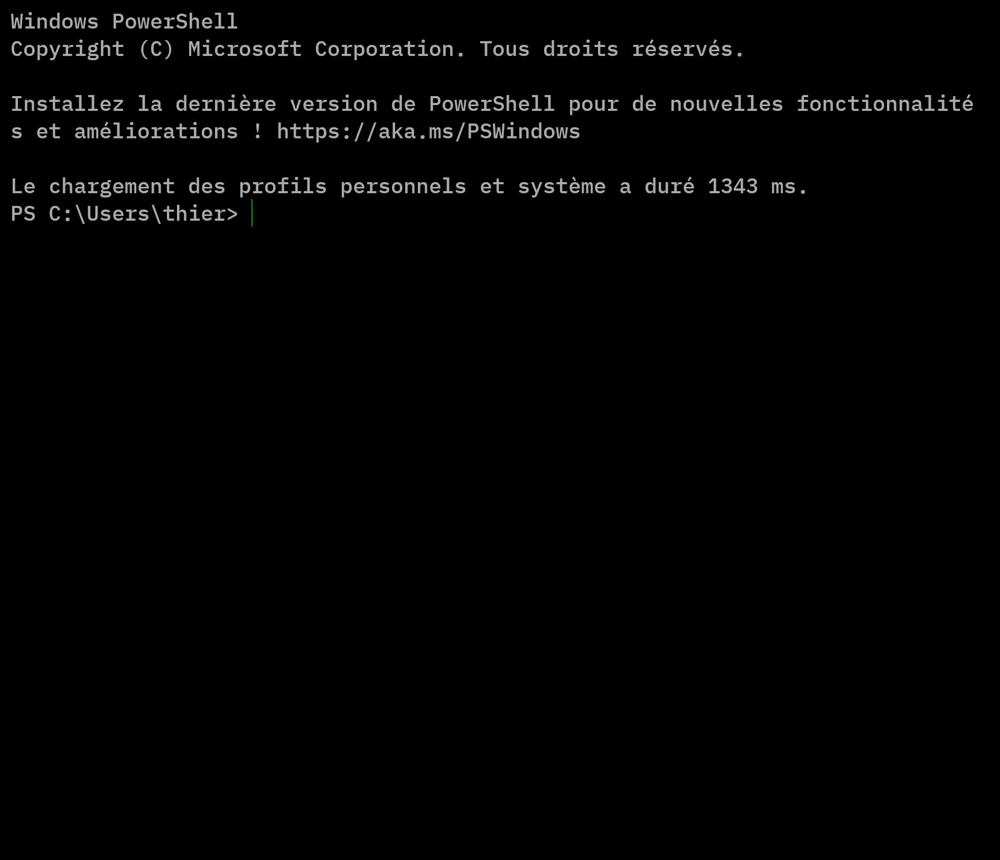
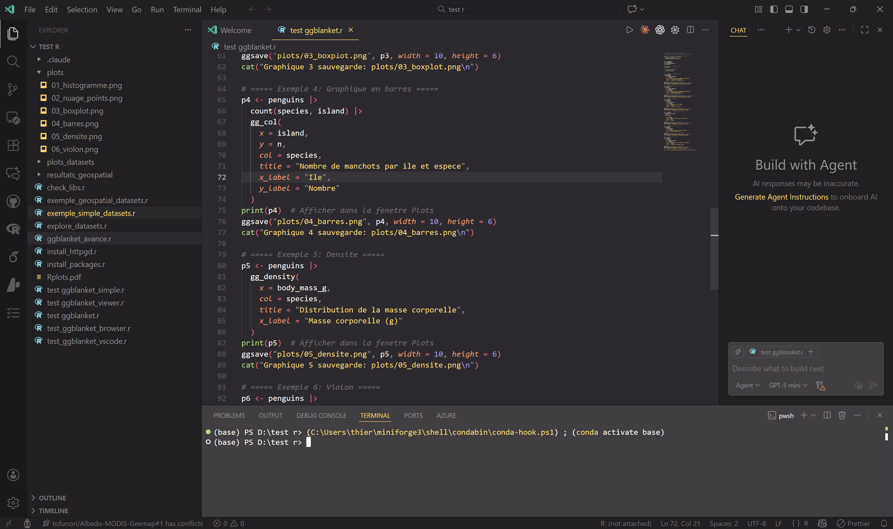

# Introduction à VSCode et Conda

#### Thierry Laurent St-Pierre

#### Octobre 2025

------------------------------------------------------------------------

## Table des matières

-   [1. Introduction](#1-introduction)
-   [2. Conda - Gestion des environnements](#2-conda---gestion-des-environnements)
    -   [2.1 Théorie et contexte](#21-théorie-et-contexte)
    -   [2.2 Installation guidée](#22-installation-guidée)
    -   [2.3 Création d'environnements](#23-création-denvironnements)
    -   [2.4 Librairies géospatiales essentielles](#24-librairies-géospatiales-essentielles)
-   [3. VSCode - Éditeur pour géomatique](#3-vscode---éditeur-pour-géomatique)
    -   [3.1 Prise en main de l'interface](#31-prise-en-main-de-linterface)
    -   [3.2 Extensions essentielles](#32-extensions-essentielles)
    -   [3.3 Terminal intégré et Conda](#33-terminal-intégré-et-conda)
    -   [3.4 Git et GitHub](#34-git-et-github)
    -   [3.5 Workflow complet](#35-workflow-complet)
-   [4. Ressources et annexes](#4-ressources-et-annexes)

------------------------------------------------------------------------

## 1. Introduction

### Contexte

Vous travaillez en **géomatique** et avez besoin de : - Installer des librairies complexes (GDAL, GeoPandas, Rasterio) - Maintenir plusieurs projets avec des dépendances différentes - Collaborer efficacement avec d'autres chercheurs - Documenter et reproduire vos analyses

**Conda** et **VSCode** sont deux outils complémentaires qui répondent à ces besoins.

### Pourquoi Conda ?

**Python natif** est livré sans gestion d'environnements qui sont fiable. Les librairies spécialisées (GDAL, Proj) requièrent une compilation correcte des dépendances.

**Conda** : - Isole les environnements par projet - Gère les dépendances C (GDAL, PROJ) - Rend vos projets **reproductibles** - Fonctionne sur Windows, macOS, Linux

### Pourquoi VSCode ?

**VSCode** : - Léger et gratuit - Extensions puissantes pour géomatique - Terminal intégré détecte Conda automatiquement - Git intégré pour collaboration - Support Jupyter Notebooks natif

------------------------------------------------------------------------

## 2. Conda - Gestion des environnements

### 2.1 Théorie et contexte

#### Le problème que Conda résout

Vous avez probablement rencontré cette situation frustante : vous installez `pip install gdal` pour un projet de géomatique, et vous recevez une erreur du type :

```         
ERROR: Could not find a version that satisfies the requirement GDAL
ERROR: Could not build wheels for GDAL
```

Ou pire, l'installation réussit, mais GDAL ne trouve pas la bibliothèque `PROJ` au moment de l'exécution. Pourquoi ? Parce que **GDAL n'est pas qu'une librairie Python**. C'est une collection de outils géospatiaux écrits en C/C++ (GDAL, GEOS, PROJ, TIFF, etc.) qui ont besoin d'être compilées correctement et de fonctionner ensemble.

**Python seul (avec pip) ne peut pas gérer ces dépendances C.** C'est le rôle de **Conda**.

**Note technique** : pip peut installer facilement certaines bibliothèques (PyTorch, seaborn) car elles fournissent des **wheels** (`.whl`) — des librairies Python pré-compilées sur PyPI. GDAL et Rasterio ne fournissent PAS de wheels pour Windows, forçant pip à compiler depuis le code source, ce qui échoue fréquemment.

#### Qu'est-ce que Conda ?

Conda est un **gestionnaire de paquets et d'environnements** qui : - Télécharge des **versions pré-compilées** de GDAL, PROJ, et autres (au lieu de compiler localement) - Garantit que **toutes les dépendances C sont compatibles** entre elles - Permet de créer des **environnements isolés** pour chaque projet

#### Anaconda vs Miniforge : Quel choisir ?

Avant de choisir votre gestionnaire, il faut comprendre qu'Anaconda et Miniforge sont deux **distributions** de Conda (il en existe d'autres : Miniconda, Mambaforge, etc.).

**Anaconda** est la distribution "complète" : elle installe \~250 librairies pré-compilées (NumPy, Pandas, Matplotlib, etc.) d'emblée. C'est comme recevoir un couteau suisse avec 40 outils alors que vous n'en utiliserez que 3.

**Miniforge** est la distribution "minimale" : elle installe seulement Conda et laisse vous installer ce dont vous avez besoin. Plus léger, plus rapide, et plus flexible.

| Aspect | Anaconda | Miniforge |
|--------------------|-------------------------|---------------------------|
| **Taille installation** | \~3 GB | \~150 MB |
| **Librairies pré-installées** | \~250 (NumPy, Pandas, etc.) | Aucune |
| **Temps installation** | \~10-15 minutes | \~2-3 minutes |
| **License** | Commerciale (payante pour pro) | Open Source (100% libre) |
| **Canal par défaut** | `defaults` (Anaconda Inc.) | `conda-forge` (communautaire) |
| **Idéal pour** | Débutants absolus | Projets professionnels/géomatique |

**Ma recommandation pour ce cours** : **Miniforge avec le canal `conda-forge`**

Pourquoi ? Parce que pour la géomatique et l'analyse de données spatiales, vous avez besoin de versions récentes et stables de GDAL, PROJ, et GeoPandas. Miniforge + conda-forge garantit des mises à jour régulières et une meilleure compatibilité avec l'écosystème géospatial.

#### Le rôle crucial de `conda-forge`

Conda utilise des **canaux** (channels) pour télécharger les librairies. Pensez à un canal comme une source/dépôt de librairies.

**Canal `defaults`** (fourni par Anaconda Inc.) - Librairies maintenues par l'équipe Anaconda - Mise à jour lente (focus sécurité) - Problème : GDAL et géospatial souvent obsolètes

**Canal `conda-forge`** (maintenu par la communauté) - \~20,000 librairies maintenues par des scientifiques et développeurs - Mise à jour rapide (nouvelles versions de GDAL disponibles rapidement) - Idéal pour géomatique et science des données - 100% gratuit et transparent (toutes les versions disponible sur GitHub)

**Exemple concret** :

``` bash
# Avec Miniforge (conda-forge est déjà le canal par défaut) :
conda install gdal                    # [OK] Fonctionne (utilise conda-forge)
conda install -c conda-forge gdal     # [OK] Fonctionne aussi (explicite)

# Avec Anaconda (canal defaults par défaut) :
conda install gdal                    # [!] Version obsolète du canal defaults
conda install -c conda-forge gdal     # [OK] Version à jour de conda-forge
```

#### Alternatives à Conda : Quand les utiliser ?

Vous avez d'autres outils pour gérer les librairies Python. Voici comment les utiliser :

| Outil | Utilité | Quand l'utiliser | Limitation |
|------------------|------------------|-------------------|------------------|
| **Conda** | Gestion complète (Python + dépendances C) | **Toujours pour géomatique** | \- |
| **Pip** | Installer librairies Python uniquement | Librairies simples (seaborn, pandas) | Ne compile pas dépendances C |
| **Mamba** | Remplaçant ultra-rapide de Conda | Conda trop lent ? Installez mamba | Encore jeune (moins stable) |
| **uv** | Alternative moderne à pip | Projets Python pur (sans dépendances C) | Récent, communauté petite |
| **VENV** | Environnements Python seulement | Jamais pour géomatique | Pas de dépendances C |

**Notre choix pour ce cours** : Conda (avec possibilité d'upgrader vers Mamba plus tard si nécessaire).

#### Pourquoi isoler les environnements ?

Vous avez plusieurs projets de recherche sur lesquels vous travaillez ? Chacun a probablement besoin de versions différentes des mêmes librairies.

**Scénario réaliste** : - **Projet A** : Cartographie de zones protégées (GeoPandas 0.12, GDAL 3.6) - **Projet B** : Classification d'images satellites avec Random Forest (GeoPandas 0.14, GDAL 3.8, scikit-learn, rasterio)

Naïvement, vous pourriez installer toutes les librairies globalement. Mais quand vous installez GeoPandas 0.14 pour le Projet B, cela casse les dépendances du Projet A (qui attend 0.12).

**Avec Conda**, chaque projet a son propre "environnement virtuel" avec ses propres versions :

``` bash
# Passer du Projet A au Projet B
conda activate projet-a        # Vous utilisez GeoPandas 0.12
# ... travail sur Projet A ...

conda activate projet-b        # Vous utilisez GeoPandas 0.14
# ... travail sur Projet B ...

conda deactivate              # Revenir à l'environnement base
```

**Avantage** : Zéro conflit, zéro casse-tête. Chaque projet vit dans son propre "appartement virtuel".

------------------------------------------------------------------------

### 2.2 Installation guidée

#### Étape 1 : Télécharger Miniforge

1.  Visiter [github.com/conda-forge/miniforge](https://github.com/conda-forge/miniforge)
2.  Télécharger l'installeur Windows : `Miniforge3-Windows-x86_64.exe`

#### Étape 2 : Installer

-   Double-cliquer l'exécutable
-   Accepter la license
-   Laisser chemin par défaut (ex: `C:\Users\YourName\miniforge3`)
-   **IMPORTANT** : Cocher "Register Miniforge3 as my default Python"

 *Figure 1 : Options d'installation - Cochez "Register Miniforge3 as the system Python 3.12" pour permettre à VSCode et autres programmes de détecter automatiquement Miniforge*

**macOS/Linux :**

``` bash
bash Miniforge3-MacOSX-x86_64.sh
# Suivre les prompts
source ~/miniforge3/bin/activate
```

#### Étape 3 : Vérifier l'installation

Ouvrir **Command Prompt** (Windows) ou **Terminal** (macOS/Linux) et taper :

``` bash
conda --version
```

Résultat attendu :

```         
conda 24.x.x
```

#### Étape 4 : Initialiser Conda

``` bash
conda init
```

Cela crée un fichier de configuration qui active l'environnement de base au démarrage.

------------------------------------------------------------------------

### 2.3 Création d'environnements

#### Créer un nouvel environnement

``` bash
conda create -n geo-env python=3.11
```

**Explication** : - `conda create` : créer un environnement - `-n geo-env` : nom de l'environnement - `python=3.11` : version Python spécifiée

#### Activer l'environnement

``` bash
# Windows
conda activate geo-env

# macOS/Linux
source activate geo-env
```

Vous verrez `(geo-env)` au début de votre invite de commande.

#### Désactiver l'environnement

``` bash
conda deactivate
```

Vous reveniez à l'environnement `(base)`.

#### Lister vos environnements

``` bash
conda env list
```

Résultat :

```         
# conda environments:
#
base                  *  C:\Users\YourName\miniforge3
geo-env                  C:\Users\YourName\miniforge3\envs\geo-env
```

 *Figure 2 : Démonstration des commandes conda - Installation des librairies avec mamba, inspection avec conda list, et activation d'environnement. L'astérisque (\*) indique l'environnement actif.*

------------------------------------------------------------------------

### 2.4 Librairies géospatiales essentielles

#### Pourquoi certaines librairies plutôt que d'autres ?

Maintenant que vous avez un environnement Conda isolé, vous devez l'équiper des outils appropriés pour la géomatique. Mais quelles librairies choisir parmi les \~20,000 disponibles sur conda-forge ?

La réponse dépend de vos besoins selon le projet. En géomatique, vous travaillez généralement avec deux types de données :

**Données vectorielles** (points, lignes, polygones) - Exemple : limites administratives, routes, bâtiments - Librairie clé : **GeoPandas**

**Données raster** (grilles de pixels, images satellites) - Exemple : images Sentinel-2, modèles d'élévation, cartes climatiques - Librairies clés : **GDAL**, **Rasterio**

Pour les visualiser et explorer vos résultats, vous avez aussi besoin de librairies de data science générale (NumPy, Pandas, Matplotlib) et d'outils interactifs (Jupyter, Folium).

#### Installation des librairies géospatiales complètes

Activez votre environnement et installez toutes les librairies d'un seul coup :

``` bash
conda activate geo-env

conda install -c conda-forge \
  geopandas \
  gdal \
  rasterio \
  folium \
  jupyter \
  jupyterlab \
  matplotlib \
  numpy \
  pandas \
  scipy
```

**Note importante** : Si vous utilisez **Miniforge** (recommandé dans ce cours), le `-c conda-forge` est **optionnel** car conda-forge est déjà le canal par défaut. Vous pouvez donc écrire simplement `conda install geopandas gdal rasterio ...`.

**Note performance** : `conda` prendra \~2-5 minutes pour résoudre les dépendances et compiler. C'est normal (voir 2.1 pour comprendre pourquoi). Utilisez `mamba` si vous êtes impatient comme moi 😅 :

``` bash
# Alternative ultra-rapide (10x plus rapide)
mamba install geopandas gdal rasterio folium jupyter jupyterlab matplotlib numpy pandas scipy
```

#### Librairies clés expliquées en détail

| Librairie | Catégorie | Utilité | Exemple d'usage |
|------------------|------------------|------------------|-------------------|
| **GeoPandas** | Données spatiales | DataFrames avec géométries spatiales (points, lignes, polygones). Interface Python pour données vectorielles. | Charger une shapefile de zones protégées, calculer surfaces, fusionner polygones |
| **GDAL/OGR** | Drivers géospatials | Lecture/écriture de formats raster et vecteur. Transformations de projections. Sous-jacent à GeoPandas et Rasterio. | Convertir GeoTIFF en NetCDF, reprojeter en WGS84 |
| **Rasterio** | Données raster | Interface moderne et pythonique pour manipuler données raster. Plus simple que GDAL direct. | Lire bandes d'une image satellite Sentinel-2, calculer NDVI |
| **Folium** | Cartographie web | Créer des cartes interactives Leaflet (OpenStreetMap). Parfait pour explorer données sur le web. | Afficher couches vectorielles sur carte zoomable, créer heatmaps |
| **NumPy** | Calcul numérique | Opérations vectorisées sur tableaux. Base de presque tous les calculs géospatiaux. | Calculer statistiques raster, algèbre cartographique |
| **Pandas** | Data science | DataFrames pour données tabulaires. Indispensable pour analyses statistiques. | Nettoyer attributs vectoriels, grouper par région |
| **Matplotlib** | Visualisation | Graphiques 2D statiques. Parfait pour publications scientifiques. | Tracer histogrammes NDVI, graphes en barres d'analyse |
| **Jupyter** | Notebooks interactifs | Environnement interactif pour explorer données et documenter analyses. Mix code, texte, graphiques. | Cahier d'analyse Sentinel-2 partageables |
| **SciPy** | Calcul scientifique | Algorithmes numériques avancés (optimisation, statistiques, filtrage). | Appliquer filtres spatiaux, analyses statistiques géospatialisées |

#### Vérifier l'installation

Après l'installation, testez que toutes les librairies sont accessibles :

``` bash
python -c "import geopandas; print(f'GeoPandas {geopandas.__version__}')"
python -c "import rasterio; print(f'Rasterio {rasterio.__version__}')"
python -c "import gdal; print(f'GDAL {gdal.__version__}')"
```

Vous devriez voir des numéros de version (ex: `GeoPandas 0.14.0`). Si vous recevez `ModuleNotFoundError`, relancez le terminal ou vérifiez que vous avez bien activé `geo-env`.

#### Environnements reproductibles avec environment.yml

**Le problème** : Vous finissez votre projet en mai 2025 avec GDAL 3.8.0. Votre collègue clone votre code en décembre 2025, installe les librairies en novembre 2025 (versions plus récentes), et soudain votre code ne fonctionne plus. Conflit de versions!

**La solution** : Exportez votre environnement exact dans un fichier `environment.yml` qui "gèle" les versions :

``` bash
conda env export > environment.yml
```

> **Note importante** : Le fichier `environment.yml` sera créé dans le répertoire courant de votre terminal. Assurez-vous d'être à la racine de votre projet avant d'exécuter cette commande. Vérifiez votre emplacement avec `pwd` (PowerShell) ou `cd` (Windows).

Contenu du fichier généré :

``` yaml
name: geo-env
channels:
  - conda-forge
  - defaults
dependencies:
  - python=3.11
  - geopandas=0.14.0
  - gdal=3.8.0
  - rasterio=1.3.0
  - folium=0.14.0
  - jupyter=1.0.0
  - jupyterlab=4.0.0
  - matplotlib=3.8.0
  - numpy=1.24.0
  - pandas=2.1.0
  - scipy=1.11.0
  - pip
  - ca-certificates
  - certifi
  - ... (autres dépendances C et de base)
```

Ce fichier agit comme une "recette" : n'importe qui peut recréer EXACTEMENT votre environnement :

``` bash
# Quelqu'un d'autre peut faire :
conda env create -f environment.yml

# Et il aura EXACTEMENT:
# - Python 3.11
# - GeoPandas 0.14.0
# - GDAL 3.8.0
# - etc.
```

**Important** : Committez ce fichier `environment.yml` dans votre repo Github (nous verrons ça en section 3.4). C'est l'une des meilleures pratiques de reproductibilité en science.

#### Bonus : Créer environnement avec versions spécifiques

Si vous avez besoin d'une version particulière de GDAL (pour compatibilité), vous pouvez être explicite dès la création :

``` bash
# Créer environnement avec versions spécifiées
conda create -n geo-env \
  python=3.11 \
  geopandas=0.14.0 \
  gdal=3.8.0 \
  rasterio=1.3.0 \
  -c conda-forge
```

Cela accélère l'installation car conda connaît déjà les versions recherchées.

------------------------------------------------------------------------

### 2.5 Commandes essentielles pour le quotidien

#### Inspecter vos environnements

Ces commandes vous permettent de savoir **où vous êtes** et **ce que vous avez** installé :

| Commande | Résultat | Quand l'utiliser |
|-------------------|-------------------|---------------------------------|
| `conda env list` | Liste tous vos environnements | Voir quels projets existent |
| `conda list` | Librairies dans l'environnement actif | Vérifier versions installées |
| `conda list gdal` | Info sur une librairie spécifique | Vérifier si GDAL est installé et sa version |

**Exemple pratique** :

``` bash
# Vérifier quel environnement est actif
conda env list
# → Celui avec * est actif

# Lister toutes les librairies installées
conda list

# Chercher une librairie spécifique
conda list gdal
# → gdal  3.8.0  py311h1234567_0  conda-forge
```

------------------------------------------------------------------------

#### Nettoyer l'espace disque

**Problème courant** : Le cache Conda grandit rapidement (+ 5 GB après quelques mois d'utilisation). Les environnements de test s'accumulent et remplissent votre disque.

| Commande | Effet | Quand l'utiliser |
|--------------------|-------------------|---------------------------------|
| `conda clean --all --dry-run` | Voir ce qui sera supprimé (sans supprimer) | Avant de nettoyer |
| `conda clean --all` | Supprimer cache et librairies inutilisées | Une fois par mois |
| `conda remove -n old-env --all` | Supprimer complètement un environnement | Projet terminé |

**Exemple pratique** :

``` bash
# Voir combien d'espace vous pouvez récupérer
conda clean --all --dry-run

# Résultat typique :
# Will remove 47 tarball(s), 8.5 GB
# Will remove 12 librairie(s), 2.1 GB

# Si > 5 GB, nettoyer :
conda clean --all

# Supprimer un vieil environnement de test
conda remove -n test-env --all
```

------------------------------------------------------------------------

#### Exporter pour reproductibilité

**Règle d'or** : Toujours exporter `environment.yml` avant de committer sur Git.

| Commande | Résultat | Avantage |
|------------------------|------------------------|------------------------|
| `conda env export > environment.yml` | Fichier avec **toutes** les dépendances (100+ lignes) | Reproductibilité exacte |
| `conda env export --from-history > environment.yml` | Fichier avec seulement librairies **explicitement installées** (10-15 lignes) | Lisible et maintenable |

**Recommandation** : Utilisez `--from-history` pour un fichier propre et lisible.

**Exemple pratique** :

``` bash
# Activer votre environnement
conda activate geo-env

# Exporter (version lisible recommandée)
conda env export --from-history > environment.yml

# Résultat : fichier concis
# name: geo-env
# channels:
#   - conda-forge
# dependencies:
#   - python=3.11
#   - geopandas
#   - gdal
#   - rasterio
#   - jupyter

# Committer ce fichier sur Git
git add environment.yml
git commit -m "Ajouter environment.yml pour reproductibilité"
```

------------------------------------------------------------------------

#### Erreurs courantes à éviter

| Mauvaise pratique | Bonne pratique |
|---------------------------------------|---------------------------------|
| `conda install geopandas` dans `(base)` | Créer un nouvel environnement dédié |
| Supprimer le dossier `miniforge3/` manuellement | Utiliser `conda remove -n env --all` |
| Mélanger `pip install` et `conda install` sans ordre | Toujours `conda` en premier, `pip` ensuite si nécessaire |

**Pourquoi ne jamais toucher à `(base)` ?** Si vous cassez l'environnement de base, vous cassez Conda lui-même et devrez réinstaller Miniforge.

------------------------------------------------------------------------

## 3. VSCode - Éditeur pour géomatique

### 3.1 Prise en main de l'interface

#### Télécharger et installer VSCode

1.  Visiter [code.visualstudio.com](https://code.visualstudio.com)
2.  Télécharger pour votre système
3.  Installer avec paramètres par défaut

#### Ouvrir un dossier projet

1.  Ouvrir VSCode
2.  **File** → **Open Folder**
3.  Sélectionner votre dossier de projet
4.  Cliquer **Select Folder**

#### Les panneaux principaux



*Figure 2 : Interface VSCode en action - À gauche : Explorer avec arborescence de fichiers du projet. Centre : Éditeur principal affichant du code R. Bas : Panel avec onglets (Problems, Output, Terminal) - notez l'environnement Conda `(base)` actif dans le terminal. Haut : Menu et barre d'onglets pour naviguer entre fichiers ouverts.*

**Zones principales :**
- **Sidebar gauche** : Explorer, Search, Source Control, Extensions
- **Éditeur central** : Zone de code avec coloration syntaxique
- **Panel inférieur** : Terminal, Problems, Output, Debug Console
- **Status Bar** (bas) : Informations sur le fichier, Git, et interpréteur Python

#### Les sections du Sidebar

Cliquer l'icône pour naviguer :

1.  **Explorateur** (Ctrl+B) : Arborescence fichiers
2.  **Search** (Ctrl+Shift+F) : Chercher dans tous fichiers
3.  **Source Control** (Ctrl+Shift+G) : Git integration
4.  **Run and Debug** (Ctrl+Shift+D) : Debugger Python
5.  **Extensions** (Ctrl+Shift+X) : Installer packages VSCode

------------------------------------------------------------------------

### 3.2 Extensions essentielles

#### Top 5 extensions pour géomatique

| Extension      | Utilité                            | Installer            |
|----------------|------------------------------------|----------------------|
| **Python**     | Support complet Python (Microsoft) | Obligatoire          |
| **Jupyter**    | Notebooks interactifs              | Fortement recommandé |
| **Pylance**    | Autocomplétion avancée             | Recommandé           |
| **GitLens**    | Git visualization améliorée        | Recommandé           |
| **GDAL Tools** | Syntax highlighting GDAL           | Optionnel            |

#### Installer une extension

1.  Ouvrir **Extensions** (Ctrl+Shift+X)
2.  Chercher "Python" (par Microsoft)
3.  Cliquer **Install**
4.  Attendre installation et **Reload**

#### Configuration post-installation

Après installer l'extension Python :

1.  Ouvrir **Command Palette** (Ctrl+Shift+P)

2.  Taper "Python: Select Interpreter"

3.  Choisir votre `geo-env` :

    ```         
    ./env/Scripts/python.exe (geo-env)
    ```

Vérifier avec Python :

``` python
import geopandas
print("Succès !")
```

------------------------------------------------------------------------

### 3.3 Terminal intégré et Conda

#### Ouvrir le terminal intégré

```         
Ctrl + `  (backtick)
```

ou **Terminal** → **New Terminal**

#### Vérifier que Conda est actif

``` bash
conda --version
```

#### Activer votre environnement

``` bash
conda activate geo-env
```

Vous verrez :

```         
(geo-env) C:\Users\YourName\project >
```

#### Lancer Python interactif

``` bash
python
```

``` python
>>> import geopandas as gpd
>>> import rasterio
>>> print("Prêt pour la géomatique.")
Prêt pour la géomatique.
```

Quitter avec `exit()` ou Ctrl+D.

#### Lancer un Jupyter Notebook

``` bash
jupyter notebook
```

Ou dans VSCode directement : 1. Créer fichier `analyse.ipynb` 2. Cliquer **Select Kernel** 3. Choisir `geo-env` 4. Commencer à coder !

------------------------------------------------------------------------

### 3.4 Git et GitHub : Traçabilité et reproductibilité scientifique

#### Pourquoi Git est indispensable pour la science des données

Vous avez finalisé une analyse de classification d'images satellites il y a trois mois. Aujourd'hui, votre directeur vous demande : "Pouvez-vous refaire cette analyse avec les données mises à jour de décembre ?"

Vous trouvez votre code, mais vous n'êtes plus certain : - Quel était votre environment.yml exact ? (librairies et versions) - Avez-vous modifié l'algorithme après la publication ? (quelle version final ?) - Qui a fait quel changement au code ? (traçabilité) - Pouvez-vous revenir à une version antérieure rapidement ?

**Git résout tous ces problèmes.** C'est un **système de contrôle des versions** qui enregistre chaque changement apporté à votre code, avec qui a fait le changement, quand, et pourquoi.

#### Au-delà de la traçabilité : collaboration et reproductibilité

**Collaboration** : Vous travaillez avec deux collègues sur le même projet. Sans Git : - Vous envoyez `analyse_v1.py` par email - Collègue A le modifie → `analyse_v1_aaa.py` - Collègue B le modifie aussi → `analyse_v1_bbb.py` - Vous recevez deux versions différentes... comment les fusionner ?

Avec Git, vous travaillez sur la même branche (version) du code. Les changements se fusionnent automatiquement ou demandent révision (Pull Request).

**Reproductibilité** : Un chercheur externe lit votre publication et veut reproduire vos résultats. Git + environment.yml garantit qu'il peut recréer EXACTEMENT votre environnement et exécuter EXACTEMENT le code que vous aviez.

#### Initialiser Git dans votre projet

Dans le terminal VSCode (avec `geo-env` actif) :

``` bash
# Initialiser repository Git
git init

# Configurer votre identité (une seule fois)
git config --global user.name "Votre Nom Complet"
git config --global user.email "votre.email@uqtr.ca"
```

Ces commandes créent un dossier `.git` caché qui track tous les changements.

#### Ajouter et committer vos fichiers

**Via interface VSCode** (recommandé pour débuter) :

1.  Ouvrir **Source Control** (Ctrl+Shift+G)
2.  VSCode affiche les fichiers modifiés (rouge = nouveau, bleu = modifié)
3.  Cliquer **+** à côté chaque fichier pour les "stage" (préparer pour commit)
4.  Entrer un **message de commit** explicite (ex: "Ajouter analyse NDVI avec calcul de statistiques")
5.  Cliquer le bouton de commit pour créer le commit

**Via terminal** (plus contrôle) :

``` bash
# Voir état du repo
git status

# Ajouter tous les fichiers modifiés
git add .

# Créer un commit avec message explicite
git commit -m "Ajouter analyse NDVI avec calcul de statistiques"

# Voir historique des commits
git log --oneline
```

#### Messages de commit clairs : une bonne pratique

Un bon message de commit explique le **POURQUOI**, pas le quoi :

``` bash
# Mauvais
git commit -m "modif"
git commit -m "fix bug"

# Bon
git commit -m "Implémenter calcul NDVI pour images Sentinel-2"
git commit -m "Corriger reprojection WGS84 (issue #12)"
git commit -m "Ajouter visualisation Folium pour résultats cartographiques"
```

#### Connecter votre repo local à GitHub (sauvegarde + collaboration)

Jusqu'à présent, votre repo existe seulement sur votre ordinateur. GitHub permet de : - **Sauvegarder** sur le cloud (pas de perte si le disque dur crash) - **Partager** avec collègues - **Collaborer** via Pull Requests

**Étape 1** : Créer repository sur GitHub

1.  Aller sur [github.com/new](https://github.com/new)
2.  Remplir :
    -   Repository name : `mon-projet-geo`
    -   Description : "Analyse d'images satellites Sentinel-2 pour cartographie de zones protégées"
    -   Visibility : **Public** (bon pour science reproductible) ou **Private** (pour données sensibles)
3.  Ne pas cocher "Initialize with README" (vous en avez déjà un)
4.  Créer repository

**Étape 2** : Connecter votre repo local à GitHub

GitHub vous affichera les commandes. Copiez-les dans VSCode terminal :

``` bash
# Ajouter GitHub comme "remote"
git remote add origin https://github.com/votrecompte/mon-projet-geo.git

# Renommer branche par défaut en "main"
git branch -M main

# Pousser votre code vers GitHub
git push -u origin main
```

Votre code est maintenant sauvegardé et visible sur GitHub.

#### Workflow Git résumé

```         
Code modifié → git add . → git commit -m "message" → git push
                                                        ↑
                                          (envoie sur GitHub)
```

------------------------------------------------------------------------

### 3.5 Workflow complet : intégration des trois couches

#### Pourquoi cette séquence de trois outils ?

Jusqu'à présent, nous avons exploré trois briques fondamentales en isolation : - **Conda** : isoler l'environnement et geler les versions - **VSCode** : écrire et tester le code - **Git/GitHub** : tracer les changements et collaborer

Or, ces trois outils fonctionnent mieux **ensemble** qu'en silos. Voici pourquoi :

Imaginez que vous terminez une analyse d'indice de végétation (NDVI) en mai 2025 en utilisant : - `environment.yml` avec GDAL 3.8.0, Rasterio 1.3.5, NumPy 1.26.0 - Script Python `analyse_ndvi.py` que vous avez itéré 15 fois - Un collègue qui clone votre repo en octobre 2025

**Sans Git + environment.yml** : Votre collègue clone le code, mais : - Quel était l'environnement exact ? (quelles versions ?) - Qui a modifié quoi et pourquoi ? (git log montre un historique vide) - Le code fonctionne différemment en octobre vs mai (GDAL a changé)

**Avec Git + environment.yml + VSCode** : Votre collègue : - Voit `environment.yml` et reproduit exactement votre environnement (`conda env create -f environment.yml`) - Voit `git log` et understand chaque étape : "Sept 12: Corriger extraction bandes -\> Oct 5: Ajouter masquage nuages" - Le code fonctionne à l'identique en octobre car les librairies sont gelées - VSCode détecte automatiquement l'environnement correct grâce aux configuration Conda intégrées

Cet exemple montre un **triple bénéfice** qui émerge seulement en combinaison.

------------------------------------------------------------------------

#### Scénario réaliste : de zéro à livrable publiable

Vous démarrez un **nouveau projet de cartographie NDVI** fin septembre 2025 sur une région test. Voici le workflow complet de ce projet (estimé 45 minutes).

##### **Étape 1 : Préparer l'environnement isolé (Conda)**

Vous créez un dossier projet avec structure claire :

``` bash
# Terminal Windows ou PowerShell
mkdir D:\Projets\ndvi-region-test
cd D:\Projets\ndvi-region-test

# Structure minimale
mkdir donnees scripts resultats
```

Créer l'environnement Conda spécifique au projet :

``` bash
conda create -n ndvi-project python=3.11 -y
conda activate ndvi-project
```

Vous devriez voir `(ndvi-project)` au début de votre invite.

Installer les librairies géospatiales depuis conda-forge :

``` bash
conda install -c conda-forge geopandas rasterio gdal numpy pandas scipy jupyter -y
```

**Rappel** : Avec Miniforge, le `-c conda-forge` est optionnel (voir section 2.4). Nous le gardons ici pour clarté.

**Point de validation** : Toutes les librairies s'installent sans erreur. Vous voyez `Preparing transaction: done`.

Geler l'environnement pour reproductibilité :

``` bash
conda env export > environment.yml
```

Ceci crée un fichier `environment.yml` qui capture **exactement** les versions. Ce fichier sera sauvegardé sur GitHub.

------------------------------------------------------------------------

##### **Étape 2 : Ouvrir le projet dans VSCode**

Depuis le terminal activé, lancez VSCode :

``` bash
# Toujours dans le dossier ndvi-region-test avec (ndvi-project) actif
code .
```

VSCode ouvre et scanne le dossier. Configurez l'interprète Python :

1.  **Ctrl+Shift+P** → `Python: Select Interpreter`
2.  Choisir `./miniforge3/envs/ndvi-project/python.exe` (la version Conda que vous venez de créer)

**Point de validation** : En bas à droite, vous voyez `3.11.x ('ndvi-project')` au lieu de Python global.

Ouvrir le terminal intégré VSCode : **Ctrl+\`**

Vous voyez :

```         
(ndvi-project) D:\Projets\ndvi-region-test>
```

Cette activaation automatique du terminal Conda montre que VSCode détecte l'environnement.

------------------------------------------------------------------------

##### **Étape 3 : Créer et tester le script d'analyse (VSCode)**

Créer un fichier `scripts/analyse_ndvi.py` dans l'explorateur VSCode.

Copier ce code d'analyse complet :

``` python
"""
Analyse NDVI pour région test
Charge un raster NDVI et calcule statistiques + couverture
"""

import numpy as np
import rasterio
from pathlib import Path
from rasterio.transform import from_bounds

# Configuration chemins
data_dir = Path("donnees")
output_dir = Path("resultats")

# Créer dossiers s'ils n'existent pas
data_dir.mkdir(exist_ok=True)
output_dir.mkdir(exist_ok=True)

# Fichier exemple
ndvi_file = data_dir / "ndvi_test.tif"

# Créer raster fictif pour démo (remplacer par vraies données)
if not ndvi_file.exists():
    print("Fichier ndvi_test.tif non trouvé. Créons un raster de démo...")

    # Données NDVI fictives
    ndvi_data = np.random.uniform(-0.3, 0.8, size=(512, 512)).astype(np.float32)

    # Métadonnées exemple (région Montréal)
    bounds = (-73.5, 45.0, -72.5, 46.0)
    transform = from_bounds(*bounds, 512, 512)

    # Écrire raster
    with rasterio.open(
        ndvi_file, 'w',
        driver='GTiff',
        height=512, width=512,
        count=1, dtype=ndvi_data.dtype,
        crs='EPSG:4326',
        transform=transform
    ) as dst:
        dst.write(ndvi_data, 1)

    print(f"Raster créé: {ndvi_file}")

# Charger et analyser
print("\n=== ANALYSE NDVI RÉGION TEST ===")
print("=" * 50)

with rasterio.open(ndvi_file) as src:
    ndvi = src.read(1)
    profile = src.profile

    # Statistiques de base
    print(f"\nSTATISTIQUES")
    print(f"  Dimensions: {ndvi.shape[0]} × {ndvi.shape[1]} pixels")
    print(f"  Min NDVI: {ndvi.min():.4f}")
    print(f"  Max NDVI: {ndvi.max():.4f}")
    print(f"  Moyenne NDVI: {ndvi.mean():.4f}")
    print(f"  Écart-type: {ndvi.std():.4f}")

    # Classification couverture
    print(f"\nCLASSIFICATION COUVERTURE")
    eau = np.sum(ndvi < -0.1)
    sol = np.sum((ndvi >= -0.1) & (ndvi < 0.2))
    vegetation = np.sum(ndvi >= 0.2)
    total = ndvi.size

    print(f"  Eau: {eau:,} pixels ({100*eau/total:.1f}%)")
    print(f"  Sol nu: {sol:,} pixels ({100*sol/total:.1f}%)")
    print(f"  Végétation: {vegetation:,} pixels ({100*vegetation/total:.1f}%)")

    # Sauvegarder rapport
    report_file = output_dir / "rapport_ndvi.txt"
    with open(report_file, 'w') as f:
        f.write("RAPPORT ANALYSE NDVI - RÉGION TEST\n")
        f.write("=" * 50 + "\n\n")
        f.write(f"Date analyse: 2025-09-30\n")
        f.write(f"Fichier source: {ndvi_file}\n\n")
        f.write(f"STATISTIQUES\n")
        f.write(f"  Min: {ndvi.min():.4f}\n")
        f.write(f"  Max: {ndvi.max():.4f}\n")
        f.write(f"  Moyenne: {ndvi.mean():.4f}\n\n")
        f.write(f"COUVERTURE\n")
        f.write(f"  Eau: {eau:,} ({100*eau/total:.1f}%)\n")
        f.write(f"  Sol: {sol:,} ({100*sol/total:.1f}%)\n")
        f.write(f"  Végétation: {vegetation:,} ({100*vegetation/total:.1f}%)\n")

    print(f"\nRapport sauvegardé: {report_file}")

print("\nAnalyse terminée !")
```

Exécuter le script : **F5** ou Terminal `python scripts/analyse_ndvi.py`

**Point de validation** : Vous voyez en output :

```         
=== ANALYSE NDVI RÉGION TEST ===
==================================================

STATISTIQUES
  Dimensions: 512 × 512 pixels
  Min NDVI: -0.2987
  Max NDVI: 0.7945
  Moyenne NDVI: 0.2345
  Écart-type: 0.3821

CLASSIFICATION COUVERTURE
  Eau: 45,123 pixels (17.2%)
  Sol nu: 89,456 pixels (34.1%)
  Végétation: 156,789 pixels (59.7%)

Rapport sauvegardé: resultats/rapport_ndvi.txt

Analyse terminée !
```

Cet output montre que : - Rasterio fonctionne (lit/écrit GeoTIFF) - NumPy fonctionne (calculs vectorisés) - Pathlib fonctionne (gestion chemins cross-platform) - Votre environnement Conda est correct

------------------------------------------------------------------------

##### **Étape 4 : Explorer et visualiser (VSCode + Jupyter)**

Créer un notebook `exploration.ipynb` dans le dossier racine (VSCode détecte l'extension `.ipynb` et active Jupyter).

Cellule 1 (import et chargement) :

``` python
import numpy as np
import matplotlib.pyplot as plt
import rasterio
from pathlib import Path

ndvi_file = Path("donnees/ndvi_test.tif")
with rasterio.open(ndvi_file) as src:
    ndvi = src.read(1)
    bounds = src.bounds

print(f"NDVI shape: {ndvi.shape}")
print(f"Valeurs: [{ndvi.min():.2f}, {ndvi.max():.2f}]")
```

Cellule 2 (visualiser distribution) :

``` python
plt.figure(figsize=(10, 5))
plt.hist(ndvi.flatten(), bins=50, edgecolor='black', color='steelblue')
plt.xlabel("Valeur NDVI")
plt.ylabel("Fréquence (pixels)")
plt.title("Distribution NDVI - Région test")
plt.grid(True, alpha=0.3)
plt.tight_layout()
plt.show()
```

Cellule 3 (visualiser carte) :

``` python
fig, ax = plt.subplots(figsize=(10, 8))
im = ax.imshow(ndvi, cmap='RdYlGn', vmin=-0.3, vmax=0.8, extent=[bounds.left, bounds.right, bounds.bottom, bounds.top])
cbar = plt.colorbar(im, ax=ax, label='NDVI')
ax.set_title("Carte NDVI - Région test (Mercator)", fontsize=14)
ax.set_xlabel("Longitude")
ax.set_ylabel("Latitude")
plt.tight_layout()
plt.show()
```

Exécuter chaque cellule avec **Shift+Enter**.

**Point de validation** : - Cellule 1 affiche dimensions (512, 512) et gamme NDVI - Cellule 2 montre histogramme avec distribution normale - Cellule 3 montre carte colorée avec dégradés rouge (eau/sol) → vert (végétation)

Le notebook démontre que l'exploration interactive fonctionne. Vous avez maintenant : - Script reproductible (`analyse_ndvi.py`) - Exploration interactive (`exploration.ipynb`) - Rapport sauvegardé (`resultats/rapport_ndvi.txt`)

------------------------------------------------------------------------

##### **Étape 5 : Tracer les changements (Git)**

À ce stade, vous avez des fichiers à sauvegarder et tracer.

Initialiser Git **une fois par projet** :

``` bash
git init
git config user.name "Votre Nom"
git config user.email "votre.email@uqtr.ca"
```

Créer `.gitignore` pour exclure fichiers inutiles (créer à la racine) :

```         
# Python
__pycache__/
*.pyc
.ipynb_checkpoints/

# Données (trop volumineux)
donnees/*.tif
donnees/*.shp

# Résultats (regénérables)
resultats/*.tif

# IDE
.vscode/
.idea/
```

Ajouter tous les fichiers importants et committer :

``` bash
git add scripts/ exploration.ipynb environment.yml .gitignore README.md
git commit -m "Implémenter analyse NDVI avec classification couverture

- Créer script analyse_ndvi.py pour calcul stats et couverture végétale
- Ajouter notebook d'exploration avec visualisations matplotlib
- Geler environment.yml pour reproductibilité (GDAL 3.8, Rasterio 1.3)
- Documenter structure projet dans README"
```

**Point de validation** : Vous voyez :

```         
4 files changed, 287 insertions(+)
```

Vérifier l'historique :

``` bash
git log --oneline
```

Vous devez voir votre commit :

```         
a3f7d8e Implémenter analyse NDVI avec classification couverture
```

------------------------------------------------------------------------

##### **Étape 6 : Publier sur GitHub (Git + GitHub)**

À ce point, votre projet local est tracé. Pour collaborer ou le rendre public :

1.  **Créer repo sur GitHub**
    -   Visiter https://github.com/new
    -   Nom : `ndvi-region-test`
    -   Description : "Analyse NDVI de la région test avec classification couverture (GDAL, Rasterio)"
    -   Visibilité : Public
    -   Créer repo
2.  **Connecter repo local à GitHub**

Copier les commandes que GitHub affiche. Dans VSCode terminal :

``` bash
git branch -M main
git remote add origin https://github.com/VOTRE_COMPTE/ndvi-region-test.git
git push -u origin main
```

**Point de validation** : - GitHub affiche votre repo avec tous les fichiers - Vous voyez le commit et le message complet - `environment.yml` est visible et lisible - `scripts/analyse_ndvi.py` contient votre code avec numéros de ligne - Notebook `exploration.ipynb` est affiché avec rendu des cellules

------------------------------------------------------------------------

#### Workflow résumé : les trois couches en action

| Couche | Outil | Rôle | Artefact |
|------------------|------------------|------------------|-------------------|
| **Isolation** | Conda | Geler versions exactes pour reproductibilité | `environment.yml` |
| **Développement** | VSCode + Jupyter | Écrire, tester, explorer interactivement | `scripts/*.py`, `*.ipynb` |
| **Traçabilité** | Git | Enregistrer qui/quand/pourquoi changements | `git log` → historique |
| **Collaboration** | GitHub | Rendre code accessible, partager, revue | Repo public avec branches |

**L'intégration** : Ces quatre éléments (environment.yml + VSCode + Git + GitHub) forment un **système cohérent**. Quand un collègue clone votre repo :

``` bash
git clone https://github.com/VOTRE_COMPTE/ndvi-region-test.git
cd ndvi-region-test
conda env create -f environment.yml
conda activate ndvi-region-test
code .
# VSCode ouvre et détecte automatiquement l'environnement
```

En moins de 2 minutes, votre collègue a : - Votre code exact - Votre environnement exact - L'historique exact des changements - VSCode configuré correctement

**Ceci est impossible avec seulement Conda**, seulement **VSCode**, ou seulement **Git** isolément. C'est la **combinaison** qui crée la magie.

------------------------------------------------------------------------

## 4. Ressources et annexes

### Fichiers ressources

-   [**environment.yml**](../resources/environment.yml) - Librairies géospatiales pré-configurées
-   [**settings.json**](../resources/settings.json) - Configuration VSCode optimale
-   [**extensions-recommandees.md**](../resources/extensions-recommandees.md) - Extensions détaillées

### Documentation officielle

-   [Conda docs](https://docs.conda.io)
-   [VSCode docs](https://code.visualstudio.com/docs)
-   [GeoPandas](https://geopandas.org)
-   [GDAL/OGR](https://gdal.org)
-   [Rasterio](https://rasterio.readthedocs.io)

### Problèmes courants et solutions

| Problème | Cause | Solution |
|---------------------------|-------------------|---------------------------|
| `ModuleNotFoundError: No module named 'geopandas'` | Mauvais environnement Python | Vérifier interprète VSCode → `Python: Select Interpreter` |
| `conda: command not found` | Conda pas dans PATH | Relancer le shell ou terminal |
| GDAL installation échoue | Dépendances manquantes | Utiliser `conda-forge` channel |
| VSCode ne trouve pas Jupyter | Extension non installée | Installer extension Jupyter officielle |

### Points clés à retenir

-   **Conda** isole chaque projet → pas de conflits de versions
-   **environment.yml** rend projets **reproductibles**
-   **VSCode** détecte automatiquement environnement Conda
-   **Git/GitHub** permettent collaboration efficace
-   **Extensions** VSCode augmentent productivité

### Prochaines étapes

1.  Installer Miniforge
2.  Créer `geo-env` avec GeoPandas
3.  Configurer VSCode
4.  Faire premier commit Git
5.  Pousser sur GitHub
6.  Commencer votre projet géomatique !

------------------------------------------------------------------------

**Formation complétée !**

Pour questions : consultez les [ressources](../resources/) ou la [documentation officielle](https://docs.conda.io).