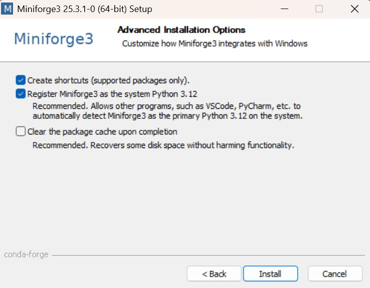

# 2.2 Conda - Installation guidée

← [Section précédente](2.1-conda-theorie.md) | [Section suivante →](2.3-conda-environnements.md)

---

## ♦︎ Étape 1 : Télécharger Miniforge

- Visiter [github.com/conda-forge/miniforge](https://github.com/conda-forge/miniforge)
- Télécharger l'installeur Windows : `Miniforge3-Windows-x86_64.exe`

---

## ♦︎ Étape 2 : Installer

- Double-cliquer l'exécutable
- Accepter la license
- Laisser chemin par défaut (ex: `C:\Users\YourName\miniforge3`)
- **IMPORTANT** ⚠︎ : Cocher "Register Miniforge3 as my default Python"



*Figure 1 : Options d'installation - Cochez "Register Miniforge3 as the system Python 3.12" pour permettre à VSCode et autres programmes de détecter automatiquement Miniforge*

**macOS/Linux :**

``` bash
bash Miniforge3-MacOSX-x86_64.sh
# Suivre les prompts
source ~/miniforge3/bin/activate
```

---

## ♦︎ Étape 3 : Vérifier l'installation

Ouvrir **Command Prompt** (Windows) ou **Terminal** (macOS/Linux) et taper :

``` bash
conda --version
```

✓ Résultat attendu :

```
conda 25.x.x
```

---

## ♦︎ Étape 4 : Initialiser Conda

``` bash
conda init
# Pour PowerShell (VSCode/Windows Terminal)
conda init powershell
```

Cela crée un fichier de configuration qui active l'environnement de base au démarrage. Rouvrez ensuite le terminal (ou VSCode) pour que les changements prennent effet.

---

← [Section précédente](2.1-conda-theorie.md) | [Section suivante →](2.3-conda-environnements.md)
